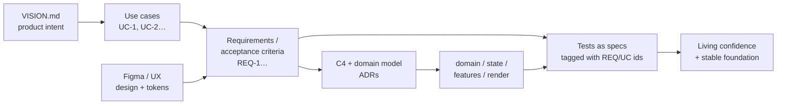

# Journey — Engineering Process & Project Management

Status: **Adopted (lightweight)**
Last updated: 2026-07-26

> How a **solo developer (+ AI agent)** keeps a growing product coherent: its
> requirements, features, architecture, design, and changes — without carrying it all
> in one head. This is our research notes **and** our operating model.

---

## 1. The problem

As Journey grows, intent lives in scattered places (head, chat, code, Figma). The risk
is drift: code that no longer matches intent, tests that assert the wrong thing, and
decisions re-litigated because nobody wrote down *why*. The goal is **one source of
truth per concern, versioned next to the code, light enough to stay current.**

---

## 2. The operating model (traceability chain)

Everything hangs off a single chain. Each link has a stable **ID** so it can be
referenced from the next link — most importantly, from tests.

**Keystone:** give each use case and requirement a stable ID, then reference those IDs
in test names/tags — e.g. `test('UC-3/REQ-7: dropping a trait on empty canvas creates a
new goal')`. The test suite then *is* the traceability matrix and the living spec, with
zero extra bookkeeping. This is the "Requirements → Testing → stable foundation" idea.

---

## 3. Modern approaches (named)

| Concern | Approach | Payoff |
|---|---|---|
| Architecture & components | **C4 model** (Context → Container → Component → Code) | 4 zoom levels of diagrams, tool-agnostic, pairs with Mermaid |
| Diagrams | **Diagrams-as-code** (Mermaid, D2, Structurizr DSL, PlantUML) | Living diagrams that version with code |
| Domains | **Domain-Driven Design** — bounded contexts, ubiquitous language, context maps; **EventStorming** to discover them | Shared vocabulary + a domain map |
| Decisions | **ADRs** (Architecture Decision Records) | A dated log of *why*, one page each |
| Use cases / requirements | **User Story Mapping** + numbered requirement IDs | The feature "backbone" + IDs to trace against |
| Requirements → build | **Spec-driven development** (GitHub Spec Kit, AWS Kiro, "spec-first") | AI-native: structured specs an agent implements & tests |
| Design → UI | **Design tokens** + **Storybook** | UI/UX consistency wired into the test layer |
| Requirements → tests | **ATDD/BDD** + **living documentation** | Acceptance criteria become executable tests |
| Runtime truth | **Observability / product analytics** | How the product *actually* behaves |

---

## 4. How FAANG / industry leaders do it

- **Design-doc-first.** Google "Design Docs", Amazon **6-pagers + PR-FAQ** ("working
  backwards" from the press release), RFC/one-pager before code. The doc — not the code
  — is where alignment happens.
- **ADRs + docs-as-code**, checked in CI (dead-link checks, diagram builds), reviewed
  in PRs alongside code.
- **Traceability via the tracker, not a spreadsheet.** Epics → stories → tasks → PRs are
  linked in Jira/Linear/GitHub Issues. Strict requirement↔test matrices (DOORS) exist
  only in *regulated* industries (aerospace/medical: DO-178C, IEC 62304).
- **C4 + Structurizr/Mermaid** increasingly replace stale wiki diagrams.
- **AI-native shift (now):** spec-driven pipelines — an agent reads a spec and produces
  code + tests; the human reviews the *spec* and the *diff*.
- **Observability closes the loop** — dashboards/analytics reveal real behavior.

The through-line: **one versioned source of truth per concern, near the code.**

---

## 5. Design tooling — Figma bridges

Figma stays the *design* source of truth; keep it connected to code via:

- **Figma Dev Mode MCP server** — exposes selected frames (layout, tokens, component
  specs) as structured context to the AI agent in VS Code. The real "design → code" path.
- **Exports** — PNG/SVG frames the agent can read and convert to components.
- **Design tokens / REST API** — export variables (color, spacing, type) as JSON tokens
  that become the single source of truth for UI, consumable by both code and tests.

> The AI agent cannot render a `.fig` file directly; it consumes the bridges above.

---

## 6. Our lightweight stack (what we adopt)

Deliberately thin — ~6 markdown artifacts + one convention. The sweet spot between
"all in my head" (fragile) and enterprise process (overkill). It also makes the AI agent
far more effective, because specs + glossary + C4 are exactly the context it uses best.

| Artifact | Location | Purpose |
|---|---|---|
| Vision | `docs/VISION.md` | Product intent & scope (exists) |
| Stack / Architecture | `docs/STACK.md`, `docs/ARCHITECTURE.md` | Tech + app structure (exists) |
| Testing strategy | `docs/TESTING.md` | Per-seam test strategy (exists) |
| **Use cases + requirements** | `docs/USE-CASES.md` | Numbered UC/REQ — the traceability root |
| **Glossary** | `docs/GLOSSARY.md` | Ubiquitous language (domain vocabulary) |
| **ADRs** | `docs/adr/NNNN-*.md` | One decision per file, dated |
| **C4 diagrams** | `docs/architecture/` | Context + Component views (Mermaid) |
| **Feature specs** | `docs/specs/NNNN-*.md` | Per-feature spec the agent works from |

**Traceability by convention:** reference `UC-…` / `REQ-…` IDs in test names/tags. Later,
a tiny script can grep tests and report uncovered requirement IDs.

**Freshness in CI:** link-check docs + build Mermaid so drift fails the build.

---

## 7. Roadmap

Phase 0 establishes the **requirements/domain foundation** so that the testing rollout
(from `docs/TESTING.md`) can trace to named IDs from day one.

- **Phase 0 — Docs foundation (done)**
  1. ✅ `docs/USE-CASES.md` — UC/REQ IDs derived from VISION + current features.
  2. ✅ `docs/GLOSSARY.md` — ubiquitous language.
  3. ✅ `docs/adr/` — embedded decisions migrated into numbered ADRs.
  4. ✅ `docs/architecture/C4.md` — C4 Context + Container + Component diagrams (Mermaid).
  5. ✅ `docs/specs/_template.md` — the per-feature spec template.
- **Phase 1–5 — Testing rollout (next)** — as defined in `docs/TESTING.md`, with tests
  referencing the UC/REQ IDs from Phase 0.

---

## 8. Why this is the right call for a solo dev

- **Offloads memory** to versioned, greppable, AI-readable artifacts.
- **Low ceremony** — markdown + Mermaid you already use; no new SaaS.
- **Traceable** without a matrix tool — IDs in test names do the job.
- **AI-leverage** — the agent produces better code/tests when it can read the spec,
  glossary, and C4 context.
- **Aligned with industry** — C4, DDD, ADRs, spec-driven dev, ATDD are exactly what
  mature orgs converge on, scaled down to one person.
