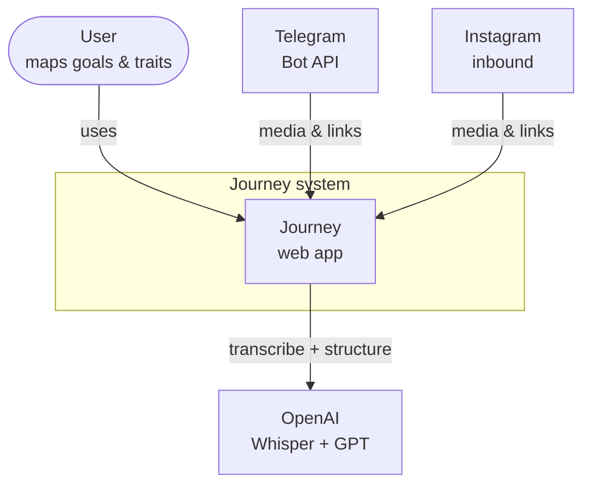
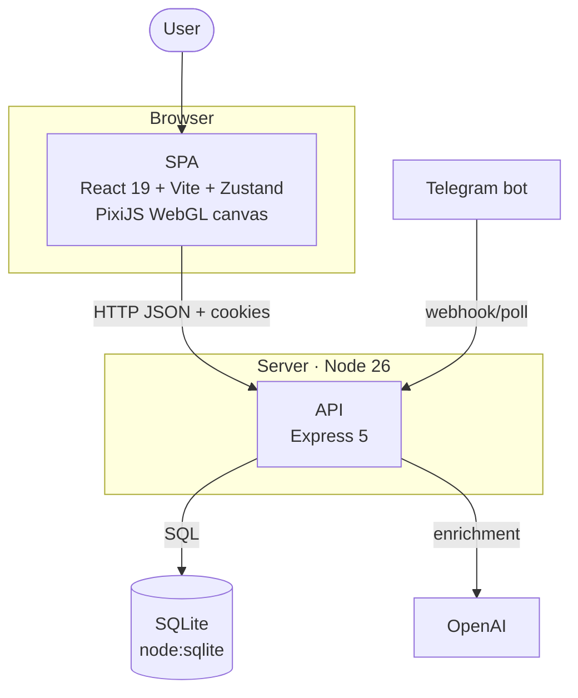
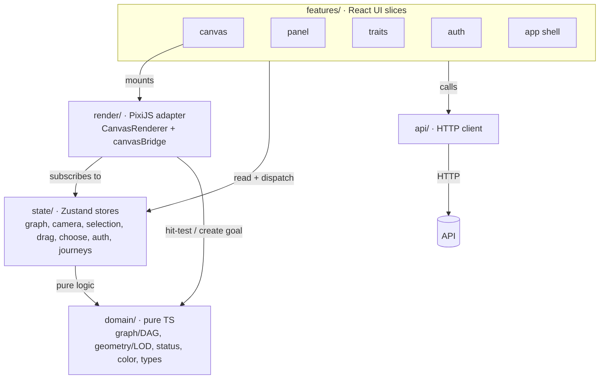
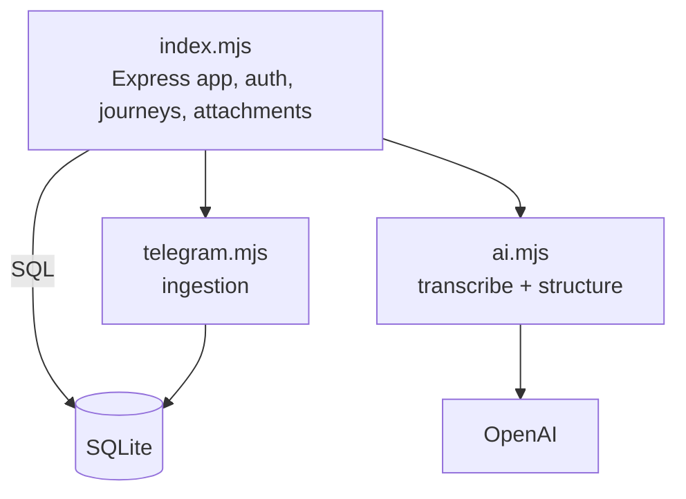

# Journey — Architecture (C4 model)

Status: **Living**
Last updated: 2026-07-26

> [C4](https://c4model.com) describes software at four zoom levels: **Context →
> Container → Component → Code**. We maintain the top three as Mermaid (the Code level is
> the source itself). See `docs/ARCHITECTURE.md` for the rationale and ADR-0001/0002 for
> the decisions.

---

## Level 1 — System Context

Who uses Journey and what it talks to.

---

## Level 2 — Containers

The deployable/runnable pieces and their data.

---

## Level 3 — Components

### Frontend (SPA) — maps to `src/`

**Key seam:** the `render` layer never owns state — it subscribes to `state` and uses
`domain` for pure math. React never re-renders the WebGL scene (ADR-0002).

### Backend (API) — maps to `server/`

