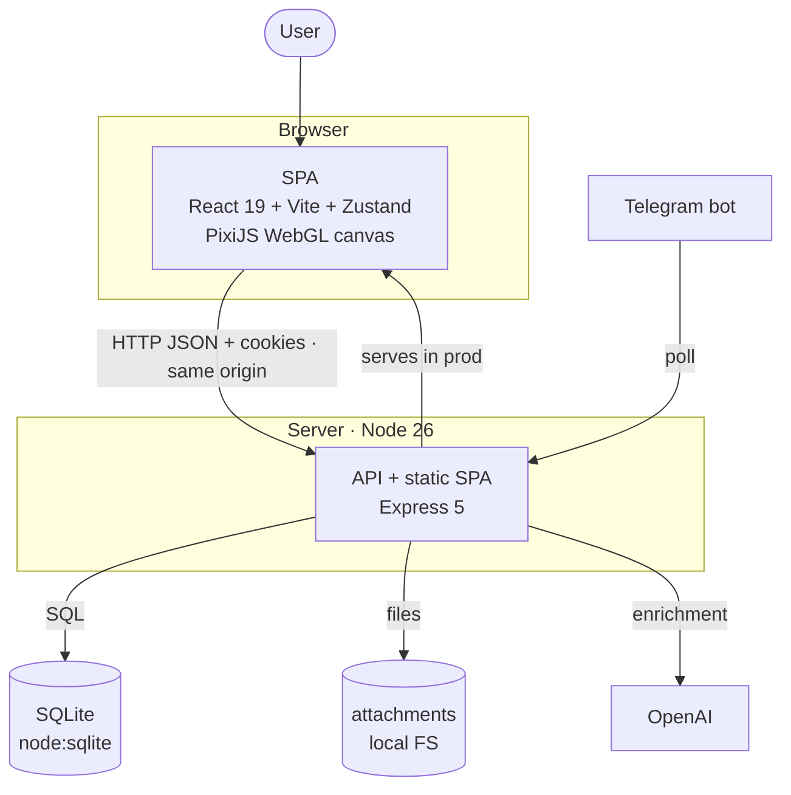
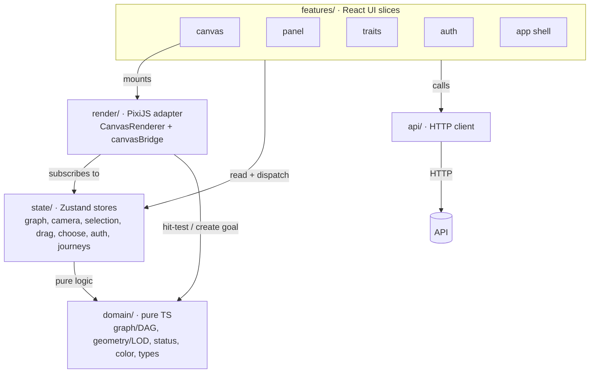
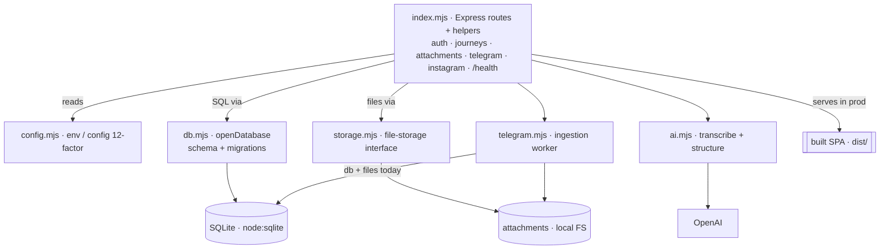
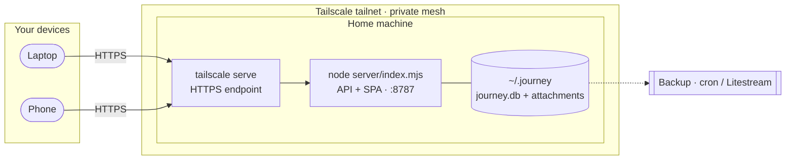

# Journey — Architecture (C4 model)

Status: **Living**
Last updated: 2026-07-30

> [C4](https://c4model.com) describes software at four zoom levels: **Context →
> Container → Component → Code**. We maintain the top three as Mermaid (the Code level is
> the source itself), plus a Deployment view. See `docs/ARCHITECTURE.md` for the
> rationale, ADR-0001/0002 for the app decisions, ADR-0005 for the data-layer seams,
> and `docs/DEPLOY.md` for the deployment runbook.

---

## Level 1 — System Context

Who uses Journey and what it talks to.

---

## Level 2 — Containers

The deployable/runnable pieces and their data.

---

## Level 3 — Components

### Frontend (SPA) — maps to `src/`

**Key seam:** the `render` layer never owns state — it subscribes to `state` and uses
`domain` for pure math. React never re-renders the WebGL scene (ADR-0002).

### Backend (API) — maps to `server/`

Data access and file storage sit behind seams (ADR-0005) so the DB and file
backends can be swapped without touching the routes.

**Swap seams (ADR-0005):** `db.mjs` is the point to move to Turso/libSQL or
Postgres; `storage.mjs` is the point to move to S3/R2. Routes stay unchanged.
The Telegram worker still touches `db` + files directly (a documented follow-up).

---

## Deployment — home + Tailscale (personal)

One always-on instance on a machine you own, reached privately over Tailscale
(`tailscale serve` gives it HTTPS so the session cookie works). See `docs/DEPLOY.md`.

**Going public later:** swap `db.mjs` → Turso/Postgres and `storage.mjs` → S3/R2,
host on Fly.io/Render (persistent volume), add a PWA for mobile. The SPA, domain,
API, and tests are backend-agnostic, so it's a contained migration.
